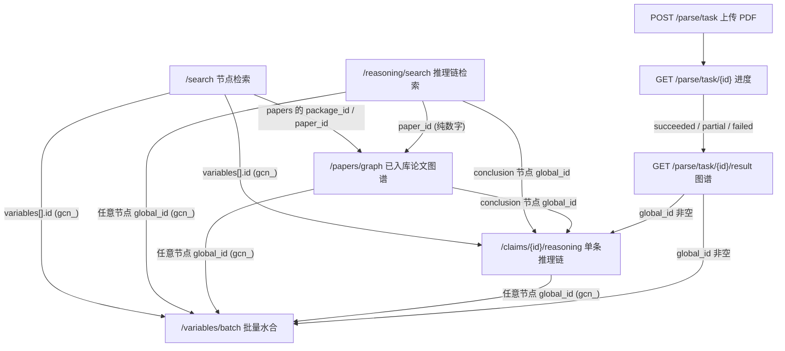

# SKILL: Bohrium LKM (大知识模型)

## 概述

通过 `open.bohrium.com` 的 LKM (Large Knowledge Model) v2 端点，对科研文献中抽取出的知识进行检索、追溯，或把手头的论文 PDF 异步抽成结构化知识：搜索摘要/命题/研究问题/推理链命中、检索完整推理链、查看已入库论文的 paper-level graph、追溯单条命题的支撑推理、按 ID 批量水合节点详情、上传 PDF 抽取研究问题/结论/推理步骤。

**核心能力：**

| 端点 | 功能 |
|------|------|
| `POST /v2/lkm/search` | 公开检索：召回 abstract / claim / question / reasoning_chain 命中；claim 和 question 还可按具体角色检索 |
| `POST /v2/lkm/reasoning/search` | 推理链检索：按论证过程相似性召回整条推理链 |
| `POST /v2/lkm/papers/graph` | 已入库论文的 paper-level graph（`papers[]` + `graph.nodes` / `graph.edges`） |
| `GET /v2/lkm/claims/{id}/reasoning` | 单条命题推理链：查某条 claim 为什么成立 |
| `POST /v2/lkm/variables/batch` | 批量水合：按节点 ID 列表批量取详情 |
| `POST /v2/lkm/feedback` | 提交反馈：对 LKM 服务/数据提交缺陷 / 需求 / 问题 |
| `POST /v2/lkm/parse/task` | 上传 PDF，创建异步抽取任务 |
| `GET /v2/lkm/parse/task/{task_id}` | 查询抽取进度（`status` 决定下一步，`stage` 做进度文案） |
| `GET /v2/lkm/parse/task/{task_id}/result` | 取抽取结果：`format=local` 扁平图谱，`format=graph` 与 `/papers/graph` 同形态；`partial` / `failed` 是 `files` |

**怎么选入口：**

- 按关键词/语义找命题、问题、论文摘要或推理链 → `/search`
- 想找"论证/实验过程"相似的整条推理链（而非单个命题）→ `/reasoning/search`
- 打开 LKM 里**已入库**的一篇论文看 nodes/edges 图谱 → `/papers/graph`
- 手头只有 PDF，库里可能还没有这篇，或要自己跑一遍抽取 → `/parse/task`（见第 7 节）
- 已有 claim ID，想看推理链 → `/claims/{id}/reasoning`
- 已有一组节点 ID，想批量补全详情 → `/variables/batch`
- 想对某个节点/论文或服务本身提交缺陷/需求/问题 → `/feedback`

**不适用：**

- 通用论文关键词搜索 → `bohrium-paper-search`
- 知识库文件管理 → `bohrium-knowledge-base`
- PDF 版面 / 文本 / 表格 / 公式抽取 → `bohrium-pdf-parser`（不是 LKM 知识图谱）

## 接口调用关系

把接口分成三类：

- **自然语言检索入口**（只需 `query`，无需预先知道任何 ID）：`/search`、`/reasoning/search`
- **基于标识/ID 的查询**（需先有论文标识或节点 ID）：`/papers/graph`（论文 `package_id`/`paper_id`/`doi`/`title`）、`/claims/{id}/reasoning`（claim `gcn_` ID）、`/variables/batch`（节点 `gcn_` ID）
- **上传 PDF 异步抽取**（只需本地 PDF）：`POST /parse/task` → `GET /parse/task/{task_id}` → `GET /parse/task/{task_id}/result`

（`/feedback` 是独立的写入接口，不在下面的检索数据流中，详见第 6 节。）

> `/papers/graph` 若已知 DOI 或标题，也可不依赖其它接口、直接作为起点；否则其 `package_id`/`paper_id` 通常来自 `/search`、`/reasoning/search` 返回的论文元数据。
> 用户上传了 PDF、库里不一定有这篇：用 `/parse/task`，不要拿 `pdf_md5` 去调 `/papers/graph`。

检索入口的输出（节点 ID、论文 ID）正是下游接口的输入。`/search` 默认按 paper 聚合：主结果 `variables[]` 每条约等于一篇论文的代表命中，同论文的其它命中折叠进 `related`。`abstract` 是论文级背景上下文，不要当 claim 使用，也不要拿去追 reasoning。



**ID 流转：**

| 上游输出 | ID 类型 | 下游可用接口 |
|------|------|------|
| `search` 的 `variables[].id`；graph 节点的 `global_id` | 全局节点 ID `gcn_...` | `variables/batch`（任意节点）；`claims/{id}/reasoning`（仅 `has_reasoning=true` 的 conclusion） |
| 各接口 `papers`/`paper` 元数据；`reasoning_chains[].paper_id` | 论文 ID（`paper:<数字>` 或纯数字串） | `papers/graph`（`package_id`/`paper_id`）；`reasoning/search` 的 `filters.paper_ids`（纯数字、无 `paper:` 前缀） |
| `POST /parse/task` 的 `data.task_id` | 解析任务 ID | `GET /parse/task/{task_id}`、`GET /parse/task/{task_id}/result` |
| parse 成功结果里的 `variables[].global_id` 或 `format=graph` 节点 `global_id`（非空） | 全局节点 ID `gcn_...` | 同上一行的 `gcn_` 下游 |
| parse 成功结果里的 `local_id`，或 `format=graph` 的节点 `id`（如 `paper:6::P1`） | 本篇局部 ID | **不能**传给 `/claims/{id}/reasoning` 或 `/variables/batch` |

**陷阱：** 不要把 graph / parse 的本地节点 ID（如 `paper:...::conclusion_3`）当成全局 `gcn_` ID 或论文 ID 往下游传——`claims/{id}/reasoning` 会返回 `290004`，`variables/batch` 会把它放进 `not_found`。`format=local` 不要塞进 `/papers/graph` 的 nodes/edges 渲染；要同形态请传 `format=graph`。

> `/feedback` 可选地复用上游产出的全局节点 ID（`gcn_id`）或论文元数据 ID（`paper_metadata_id`）来定位反馈对象，二者互斥。

## 认证配置

代码统一从环境变量 `BOHR_ACCESS_KEY` 读取 access key。根据运行环境，二选一方式提供该变量：

**方式 A：直接使用环境变量**（不依赖 OpenClaw 的场景）

```bash
export BOHR_ACCESS_KEY=<YOUR_BOHR_ACCESS_KEY>
```

**方式 B：通过 OpenClaw 注入**（在 OpenClaw 中运行时）

在 `~/.openclaw/openclaw.json` 配置，OpenClaw 会自动将 `env.BOHR_ACCESS_KEY` 注入到运行环境：

```json
"bohrium-lkm": {
  "enabled": true,
  "apiKey": "YOUR_BOHR_ACCESS_KEY",
  "env": {
    "BOHR_ACCESS_KEY": "YOUR_BOHR_ACCESS_KEY"
  }
}
```

## 通用代码模板

```python
import os, requests

AK = os.environ["BOHR_ACCESS_KEY"]
BASE = "https://open.bohrium.com/openapi/v2/lkm"
H = {"Authorization": f"Bearer {AK}", "Content-Type": "application/json"}

def lkm_data(r):
    """解包 LKM 响应：code == 0 时返回 data，否则带 code/message 抛错。"""
    body = r.json()
    if body.get("code") != 0:
        raise RuntimeError(f"LKM error {body.get('code')}: {body.get('message')}")
    return body["data"]
```

下面的示例统一走 `lkm_data(r)`，确保始终遵守上面说的 `code` 判定约定。

**业务状态判定：** HTTP 通常返回 200，是否成功看响应体里的 `code`，`code == 0` 才算成功。常见错误码见末尾错误码表。

---

## 1. 公开检索 — `POST /search`

用自然语言召回 LKM 中的 abstract / claim / question / reasoning_chain 命中。服务端默认按论文聚合，返回每篇论文最相关的一条主命中，同论文其它命中放到 `related`。返回的是检索命中和论文元信息，不是完整推理链。

```python
r = requests.post(f"{BASE}/search", headers=H, json={
    "query": "The 2017 chemistry curriculum standard increases emphasis on real‑world problem situations and contexts (explicitly including industrial production, environmental issues, and socio‑technical “hot topics”).",
    "keywords": ["real-world contexts", "industrial production", "inquiry learning"],
    "retrieval_mode": "hybrid",
    "sort_by": "comprehensive",  # 可选，默认 comprehensive；可选 relevance/recent/journal
    "scopes": [
        "abstract", "claim", "premise", "conclusion", "question",
        "problem", "open_question", "subproblem", "reasoning_chain",
    ],
    # "filters": {
    #     "paper_ids": ["811977903947382784"],  # 纯数字 ID，不带 paper: 前缀
    #     "dois": ["10.1038/s41586-021-03381-x"],
    #     "title": "perovskite stability",      # 论文标题模糊过滤
    #     "publication_date_start": "2020-01-01",
    #     "publication_date_end": "2026-12-31",
    #     "limit_publication_date": True,        # 默认 true；false 会召回无发表日期文献
    # },
    "reasoning_only": False,
    "offset": 0,
    "limit": 20
})
data = lkm_data(r)
for v in data["variables"]:
    print(v["id"], v["type"], v.get("role"), v["has_reasoning"], (v.get("content") or "")[:80])
# data["related"]: 同一篇 paper 内折叠的其它相关命中
# data["papers"]: 权威论文元数据（key 形如 paper:<id>）
# data["has_more"]: 是否还有下一页
```

**参数：**

| 字段 | 类型 | 必填 | 说明 |
|------|------|------|------|
| `query` | string | 是 | 自然语言检索语句，建议 ≤200 字 |
| `keywords` | string[] | 否 | 关键词，最多 10 个、每个 ≤100 字；放术语/材料名/方法名/缩写，不要塞整句 |
| `retrieval_mode` | string | 否 | `hybrid`(默认,语义+关键词) / `semantic`(仅语义,更快) / `lexical`(仅关键词) |
| `sort_by` | string | 否 | 排序策略，不传默认 `comprehensive`：`relevance`(纯相关性,首位最准) / `recent`(相关达标前提下偏新) / `journal`(相关达标前提下偏高质量期刊) / `comprehensive`(相关+时效+质量+多样性综合) |
| `scopes` | string[] | 否 | 限定命中范围，共 9 个合法值：`abstract`、`claim`、`premise`、`conclusion`、`question`、`problem`、`open_question`、`subproblem`、`reasoning_chain`；省略=不限定 |
| `filters.visibility` | string | 否 | 内容可见性，通常 `public` |
| `filters.role` | string | 否 | 限定 claim 角色：`conclusion`/`premise`/`highlight` |
| `filters.paper_ids` | string[] | 否 | 按论文维度限定召回范围，纯数字论文 ID，**不带 `paper:` 前缀**，最多 50 个 |
| `filters.dois` | string[] | 否 | 按论文维度限定召回范围，论文 DOI，最多 50 个；可与 `paper_ids` 同时使用 |
| `filters.title` | string | 否 | 按论文标题模糊过滤。与 `paper_ids` / `dois` 同时传时取交集（AND）。标题过滤只返回最相关的前若干篇，默认约 5 篇，不保证精确或穷尽。 |
| `filters.publication_date_start` / `filters.publication_date_end` | string | 否 | 发表日期范围，格式 `YYYY-MM-DD`；可只传一侧 |
| `filters.limit_publication_date` | bool | 否 | 默认 `true`：按日期范围过滤；若两侧日期都空，默认回落近 20 年。设为 `false` 时完全不限制发表日期，并可召回无发表日期文献。 |
| `reasoning_only` | bool | 否 | `true` 只返回有推理链支撑的 conclusion claim（旧名 `evidence_only`） |
| `include_paper_enrich` | bool | 否 | `true` 返回更丰富的论文元数据（响应变大，按需开） |
| `offset` | int | 否 | 分页起点，最大 10000 |
| `limit` | int | 否 | 每页条数，默认 20，最大 100 |

**关键返回字段：**

| 字段 | 说明 |
|------|------|
| `data.variables[]` | 聚合后的主结果列表；每条约等于一篇 paper 的代表命中。`id` 是命中对象 ID。 |
| `data.variables[].type` | 命中的高层类型：`claim` / `question` / `abstract` / `reasoning_chain` |
| `data.variables[].role` | 具体角色：claim 命中为 `premise` / `conclusion`；question 命中为 `problem` / `open_question` / `subproblem` |
| `data.variables[].score` / `rerank_score` | 检索排序分数，**不等于可信度/证据强度**，不要当置信度展示 |
| `data.variables[].has_reasoning` | 该 claim 是否有推理链可追溯（展示推理时优先选 `true`） |
| `data.variables[].provenance.source_packages` | 来源论文包 ID 列表 |
| `data.related` | 同一篇 paper 内被折叠的其它相关片段。它是 same-paper context，不是跨论文推荐，也不是完整 paper graph。 |
| `data.papers` | 权威论文元数据 map，key 形如 `paper:<id>`；论文卡片、DOI、期刊、影响因子等优先从这里取。 |
| `data.has_more` | 是否还有下一页（下一页用相同请求体，`offset += 本页条数`） |

**约束与使用策略：**

- `paper_ids`、`dois`、`title` 同时给定时取交集（AND）；任一维度命中为空则整体返回空结果。
- `scopes` 的层级为：`claim` 包含 `premise` / `conclusion`，`question` 包含 `problem` / `open_question` / `subproblem`；`abstract` 与 `reasoning_chain` 是独立范围。传父级 scope 可召回该类全部角色，传子级 scope 可只召回对应角色。
- **兼容提醒：** 所有 question 命中（包括主结果与 `related` 中的命中）的 `role` 不再统一返回 `premise`，而是按语义返回 `problem`、`open_question` 或 `subproblem`。调用方不要再用 `role == "premise"` 判断 question。
- `abstract` 是论文级背景上下文，适合快速判断论文相关性或做 RAG 背景；不要当 claim 用，也不要追 reasoning。
- `reasoning_only=true` 时，`scopes` 必须省略或 `["claim"]` / `["conclusion"]`，`filters.role` 必须省略或 `conclusion`；冲突会返回 `290002`。

> **排序说明：** `recent`/`journal`/`comprehensive` 的时效、质量加成都有相关性门控，不会塞进不相关内容；老调用方不传 `sort_by` 即自动享受更优的 `comprehensive` 默认排序。

---

## 2. 推理链检索 — `POST /reasoning/search`

召回整条推理链——即论文"得出某个结论的研究过程"（理论推导、数值计算、实验流程等），按该过程与 query 的相似度排序，而不是按单个节点的文本相似度。新调用方统一传 `format: "graph"`。

```python
r = requests.post(f"{BASE}/reasoning/search", headers=H, json={
    "query": "infer phase stability from XRD evidence",
    "keywords": ["powder XRD", "Rietveld refinement", "phase transition"],
    "retrieval_mode": "hybrid",
    "sort_by": "comprehensive",  # 可选，默认 comprehensive；可选 relevance/recent/journal
    "format": "graph",
    # "filters": {
    #     "paper_ids": ["811977903947382784"],
    #     "dois": ["10.1038/s41586-021-03381-x"],
    #     "title": "phase stability",
    #     "publication_date_start": "2020-01-01",
    #     "limit_publication_date": True,
    # },
    "offset": 0,
    "limit": 20
})
data = lkm_data(r)
for c in data["reasoning_chains"]:
    print(c["chain_id"], c["paper_id"], c["score"])
    print("  nodes:", len(c["graph"]["nodes"]), "edges:", len(c["graph"]["edges"]))
# data["total"]: 未受 limit 截断的命中总数
```

**参数：**

| 字段 | 类型 | 必填 | 说明 |
|------|------|------|------|
| `query` | string | 是 | 描述想找的推理过程，建议 ≤200 字 |
| `keywords` | string[] | 否 | 最多 10 个，放方法名/材料名/实验条件/指标/缩写 |
| `retrieval_mode` | string | 否 | `hybrid`(默认) / `semantic` / `lexical` |
| `sort_by` | string | 否 | 排序策略，取值与语义同 `/search`（`relevance`/`recent`/`journal`/`comprehensive`），不传默认 `comprehensive` |
| `filters.paper_ids` / `filters.dois` | string[] | 否 | 按论文维度限定召回范围，语义同 `/search`：纯数字 ID（无 `paper:` 前缀）/ DOI，各 ≤50，可同时使用 |
| `filters.title` | string | 否 | 论文标题模糊过滤；与 `paper_ids`、`dois` 取交集（AND） |
| `filters.publication_date_start` / `filters.publication_date_end` | string | 否 | 发表日期范围，格式 `YYYY-MM-DD`；可只传一侧 |
| `filters.limit_publication_date` | bool | 否 | 默认 `true`；两侧日期都空时回落近 20 年。`false` 完全不限制发表日期，可召回无发表日期文献。 |
| `format` | string | 否 | 推荐 `graph`，返回 `graph.nodes`/`graph.edges`；省略返回旧结构 |
| `offset` | int | 否 | 分页起点，最大 10000 |
| `limit` | int | 否 | 每页条数，默认 20，最大 100 |

**关键返回字段（`format: "graph"`）：**

| 字段 | 说明 |
|------|------|
| `data.reasoning_chains[].chain_id` | 推理链 ID |
| `data.reasoning_chains[].paper_id` | 来源论文 ID（纯数字串） |
| `data.reasoning_chains[].score` | 检索排序分数，**不要当可信度展示** |
| `data.reasoning_chains[].graph` | 推理链图谱（`nodes` / `edges`，见下方 graph 说明） |
| `data.reasoning_chains[].paper` | 来源论文元数据 |
| `data.reasoning_chains[].addressed_problems` / `open_questions` | 该链处理的问题 / 留下的开放问题 |
| `data.total` | 命中总数；分页：`offset + 本页条数 < total` 即有下一页 |

`paper_ids`、`dois`、`title` 过滤语义同 `/search`，三者取交集（AND）；任一维度命中为空则整体为空结果。

---

## 3. 论文级知识图谱 — `POST /papers/graph`

给定一篇论文，返回 LKM 从中抽取出的完整 graph（结论、推理步骤、亮点、弱点、子问题及关系边）。paper-level graph 主入口。

```python
r = requests.post(f"{BASE}/papers/graph", headers=H, json={
    "package_id": "paper:1020661015349559308"   # 四选一，见下表
})
data = lkm_data(r)
for p in data["papers"]:
    print(p["paper"]["en_title"])
    print("  nodes:", len(p["graph"]["nodes"]), "edges:", len(p["graph"]["edges"]))
    print("  addressed_problems:", len(p["addressed_problems"]))
```

**参数（4 个标识至少传 1 个，不能都空）：**

| 字段 | 类型 | 说明 |
|------|------|------|
| `package_id` | string | LKM 论文包 ID，形如 `paper:<数字>`；**优先级最高** |
| `paper_id` | string | LKM 论文 ID，纯数字串，如 `812481689673531392` |
| `doi` | string | 论文 DOI，如 `10.1038/s41586-021-03381-x` |
| `title` | string | 标题或标题关键词，可能返回多篇候选 |
| `title_resolve.limit` | int | 用 `title` 时限制候选数，默认 5，最大 20 |

> 优先级：`package_id > paper_id > doi > title`。`package_id`/`paper_id` 是 LKM 内部 ID（非 DOI/PMID），通常从其它 LKM 接口返回的 paper 元数据获取。

**关键返回字段：**

| 字段 | 说明 |
|------|------|
| `data.papers[].paper` | 论文元数据（含 `package_id`、标题、作者、DOI、期刊等） |
| `data.papers[].graph` | 论文级知识图谱（`nodes` / `edges`，见下方 graph 说明） |
| `data.papers[].addressed_problems` | 论文试图解决的核心问题 |
| `data.papers[].open_questions` | 论文留下的开放问题 / 未来工作 |

> 非 title 路径通常返回 1 篇；title 路径可能返回多篇候选（每篇可能带 `title_match_type`，如 `exact`/`keyword`）。`include`/`hydrate_factor_refs` 为历史兼容字段，新版默认 graph 响应无需使用。

---

## 4. 单条命题推理链 — `GET /claims/{id}/reasoning`

给定一个全局 claim ID（`gcn_...`），返回这条 claim 由哪些推理步骤和前提支撑。新调用方统一传 `format=graph`。

```python
claim_id = "gcn_73e13bb548f847bd"
r = requests.get(f"{BASE}/claims/{claim_id}/reasoning", headers=H,
                 params={"format": "graph", "max_chains": 10, "sort_by": "comprehensive"})
data = lkm_data(r)
print(data["claim"]["id"], "total_chains:", data["total_chains"])
for c in data["reasoning_chains"]:
    print("  paper:", c["paper"]["en_title"])
    print("  nodes:", len(c["graph"]["nodes"]), "edges:", len(c["graph"]["edges"]))
```

**参数：**

| 字段 | 位置 | 必填 | 说明 |
|------|------|------|------|
| `id` | path | 是 | 全局 claim ID，形如 `gcn_...`（不要传 graph 本地节点 ID，如 `paper:...::conclusion_3`） |
| `max_chains` | query | 否 | 推理链数量上限，默认 10，最大 100 |
| `sort_by` | query | 否 | `comprehensive`(默认,按信息量) / `recent`(按时间倒序) |
| `format` | query | 否 | 推荐 `graph`；省略或非 graph 返回旧 `factors` 结构 |

**关键返回字段（`format=graph`）：**

| 字段 | 说明 |
|------|------|
| `data.claim` | 被查询的 claim 本身（`id`/`type`/`content_hash`） |
| `data.reasoning_chains[].graph` | 推理链图谱（`nodes` / `edges`，见下方 graph 说明） |
| `data.reasoning_chains[].paper` | 该链所属论文元数据 |
| `data.reasoning_chains[].addressed_problems` / `open_questions` | 问题背景 / 开放问题 |
| `data.total_chains` | 可返回的推理链总数 |

> 建议只对 `role = conclusion` 且 `has_reasoning = true` 的 claim 调用。对 premise / weak point / 无推理链的 claim 调用可能返回 `290008`；传错 ID 类型常返回 `290004`。

---

## 5. 批量水合 — `POST /variables/batch`

按节点 ID 列表批量取详情。先用检索接口拿到 ID，再用本接口补全。**这不是检索接口。**

```python
r = requests.post(f"{BASE}/variables/batch", headers=H, json={
    "ids": ["gcn_654cd35dcb814a0c", "gcn_9523aa7f1fd04d8a"]
})
data = lkm_data(r)
for v in data["variables"]:
    print(v["id"], v["type"], (v.get("content") or "")[:80])
print("not_found:", data["not_found"])
# data["papers"]: 按 package_id 组织的论文元数据
```

**参数：**

| 字段 | 类型 | 必填 | 说明 |
|------|------|------|------|
| `ids` | string[] | 是 | 全局节点 ID（`gcn_...`），1–100 个，**不要含空字符串**；重复会去重 |

**关键返回字段：**

| 字段 | 说明 |
|------|------|
| `data.variables[]` | 命中的节点（`id`/`type`/`title`/`content`/`representative_lcn`/`local_members`/`provenance`） |
| `data.variables[].metadata` / `parameters` | **需防御式解析**：可能是空串、JSON 字符串或数组字符串 |
| `data.not_found` | 未命中的 ID 列表（传 graph 本地 ID / paper ID / package ID 会落这里） |
| `data.papers` | 按 `package_id` 组织的论文元数据 |

> 请求前先清洗：去空串、去 null、去重、单批 ≤100。部分 ID 未命中不影响整体成功（仍 `code = 0`）。

---

## 6. 提交反馈 — `POST /feedback`

对 LKM 服务 / 数据提交使用反馈。可选地关联到一个 GCN 节点或一篇论文元数据，用于定位反馈针对的具体对象。**这是写入接口，不返回知识内容。**

```python
r = requests.post(f"{BASE}/feedback", headers=H, json={
    "type": "bug",          # 必填：bug(缺陷) / feature(需求) / question(问题)，不区分大小写
    "content": "推理链查询返回结果中缺少前提节点，疑似数据缺失",  # 必填，trim 后不能为空
    "gcn_id": "gcn_0002bee76d0c4255"  # 可选；关联 GCN 节点。与 paper_metadata_id 互斥
    # 或改为关联论文：去掉 gcn_id，改传 "paper_metadata_id": "867766664756724177"
})
fb = lkm_data(r)
print("feedback id:", fb["id"])
```

**参数（Body）：**

| 字段 | 类型 | 必填 | 说明 |
|------|------|------|------|
| `type` | string | 是 | 反馈类型：`bug`(缺陷) / `feature`(需求) / `question`(问题)，不区分大小写 |
| `content` | string | 是 | 反馈正文，trim 后不能为空 |
| `gcn_id` | string | 否 | 关联的 GCN 节点 ID（来自 `/search`、graph 等），如 `gcn_0002bee76d0c4255`；与 `paper_metadata_id` 互斥 |
| `paper_metadata_id` | string | 否 | 关联的论文元数据 ID，如 `867766664756724177`；与 `gcn_id` 互斥 |

**关键返回字段：**

| 字段 | 说明 |
|------|------|
| `data.id` | 新建反馈记录的主键 ID |

> `gcn_id` 与 `paper_metadata_id` 可同时为空（不关联具体对象），但**不能同时非空**——同时传会因语义混淆被拒。

---

## 7. 上传 PDF 异步抽取 — `/parse/task`

手头只有 PDF、库里可能还没有这篇，或要自己跑一遍抽取时，用这一组接口。提交成功只表示任务已受理，不表示图谱已经出来。

和 `/papers/graph` 的分工：上传 PDF、看「我这份文件」的结果用本系列；查 LKM 里已入库论文的 paper-level graph 用 `/papers/graph`。默认 `format=local` 是扁平抽取结果；`format=graph` 才与 `/papers/graph` 同形态。

可运行的端到端脚本：`scripts/parse_paper.py`。本 skill 示例与其它 LKM 接口共用 `BASE=.../openapi/v2/lkm`。同一套 parse 路径也在 v1/v4。

**计费：** 1 元/次；cache 命中 0.1 元/次。

**提交 `POST /parse/task`：**

| 字段 | 位置 | 必填 | 说明 |
|------|------|------|------|
| `file` | multipart | 是 | 字段名必须是 `file`，内容必须是 PDF，默认不超过 64 MiB、50 页。不要再传 `doi` / `arxiv_id` |
| `Authorization` | header | 是 | `Bearer $BOHR_ACCESS_KEY` |

提交成功（`code=0`）返回 `task_id` / `pdf_md5` / `status` / `cache_hit` / `cache_source` / `created_at`。`cache_source` 只在 `cache_hit=true` 时出现：`lkm` 表示论文已在 LKM 库中，`local` 表示复用此前同一 PDF（md5 相同）的抽取。仍要以 `status` 为准：

- `queued`：新跑或重跑，去轮询进度。
- `succeeded`：已有完整图谱，可马上取结果。
- `partial`：**业务终态**，这篇 PDF 抽不出完整图谱（综述、过短、合集等）。不是跑到一半。再交同一份文件仍是 `partial` + `cache_hit=true`，不会重跑。
- 同一用户、同一 PDF 仍在 `queued` / `running` 再提交：`290020`，错误里带已有 `task_id`。
- 上次是技术失败（`failed`）：会重新排队，`cache_hit=false`。

不要靠反复提交催进度。

**进度 `GET /parse/task/{task_id}`：**

用 `status` 决定下一步，用 `stage` 做进度文案（不要把 `step0` 这种内部名直接展示给用户）。

| status | 下一步 |
|--------|--------|
| `queued` / `running` | 每 5 秒轮询本接口 |
| `succeeded` | 调结果接口取图谱 |
| `partial` | 业务不可重试失败。调结果接口看 `failed_reason`；不要再交同一份 PDF |
| `failed` | 技术失败。展示映射后的 `failed_reason`；同一份文件可以再提交 |

`stage` 常见顺序：`metadata` → `ocr` → `step0` → `step1` → `step2_3` → `step4` → `graph` → `done`。`step2_3` 是 step2/step3 并行，耗时往往更长。`queued` / `running` 时去调结果接口会得到 `290017`，这不是任务丢了。

进度和结果还会返回 `step_durations`，按流水线顺序列出已完成或跳过步骤的耗时，每项为 `{"step":"step1","duration_ms":400}`。它不含提交阶段完成的 `metadata`；步骤顺序为 `ocr` → `step0` → `step1` → `step2` → `step3` → `step4` → `graph`。

**结果 `GET /parse/task/{task_id}/result`：**

| Query | 说明 |
|------|------|
| `format` | 可选。不传或 `local`：扁平 `variables` / `factors` / `motivations` / `stats`。`graph`：与 `/papers/graph` 同形态的 `paper` + `addressed_problems` + `open_questions` + `graph.nodes` / `graph.edges`。只影响 `succeeded`。非法值 `290015` |

| 情况 | `data` 形状 |
|------|-------------|
| `succeeded` | 固定带 `task_id` / `status=succeeded` / `cache_hit`（`true` 时还有 `cache_source`）和 `step_durations`；再按 `format` 带图谱 |
| `partial` | `task_id` / `status=partial` / `cache_hit` / `stage` / `failed_reason` / `files` / `step_durations`。不看 `format`。不要再交同一份 PDF |
| `failed` | 同上，`status=failed`。同一份文件可再提交 |
| 仍在排队或执行中 | `code=290017`，回到进度接口 |

成功结果里的 `local_id` 或 graph 节点 `id` 不能传给 `/claims/{id}/reasoning` 或 `/variables/batch`；只有 `global_id` 有值时才是 LKM 全局 ID。`format=local` 的 `parameters` / `metadata` 是 JSON 字符串；`format=graph` 的节点 `metadata` 是对象。综述、内容过短、多摘要合集等会落成 `partial`，`files` 为空是预期行为。

---

## graph 公共说明（`/papers/graph`、`/reasoning/search?format=graph`、`/claims/{id}/reasoning?format=graph`、parse `format=graph` 共享）

`graph` 由 `nodes` 和 `edges` 组成，可直接用于前端图谱渲染。

**节点 `kind`：**

| kind | 含义 |
|------|------|
| `conclusion` | 结论节点（端点 4 中通常对应传入的 claim） |
| `reasoning_steps` | 支撑结论的推理步骤，通常含 `steps[]` 数组 |
| `highlight` | 正向亮点 / 关键证据 / 支持性观察 |
| `weak_point` | 弱点 / 限制 / 风险 / 需审慎看待的前提 |
| `subproblem` | 驱动该结论的子问题或研究动机 |

**边 `type`：**

| type | 含义 |
|------|------|
| `concludes` | reasoning_steps 指向 conclusion |
| `highlight_of` | highlight 指向它支持的 reasoning_steps（正向） |
| `weakpoint_of` | weak_point 指向它削弱的 reasoning_steps（限制/风险） |
| `subproblem_of` | subproblem 指向它驱动的 conclusion |
| `previous_conclusion_of` | 前序结论与当前结论/推理单元的上下文关系 |

**注意：**

- `highlight_of` 与 `weakpoint_of` 语义相反——前者正向、后者表示限制或风险；不要把所有边都当成"支持"。
- 不要把 `highlight` 当最终结论，不要把 `weak_point` 当正向证据，不要把 `subproblem` 当支撑证据。
- 边上的 `p1`/`p2` 是模型/图谱内部参数，**不要直接当作用户侧可信度展示**。
- `reasoning_steps.steps` 建议作为节点详情展开，不必默认拆成多个主图节点。

---

## 典型工作流：验证并追溯一个科学结论

> 思路：先用 `/search`（`reasoning_only=true`）找到"有推理链支撑的结论"，再用 `/claims/{id}/reasoning` 看它为什么成立。

```python
# 1) 检索：只要有推理链支撑的 conclusion claim
res = lkm_data(requests.post(f"{BASE}/search", headers=H, json={
    "query": "perovskite thermal stability at 85 C",
    "keywords": ["FAPbI3", "thermal stability"],
    "retrieval_mode": "hybrid",
    "reasoning_only": True,
    "scopes": ["conclusion"],
    "limit": 10,
}))

# 2) 取第一个可追溯的结论
claim = next((v for v in res["variables"] if v.get("has_reasoning")), None)
if not claim:
    print("未找到可追溯推理链的结论")
else:
    print("结论:", (claim.get("content") or "")[:120])
    # 3) 追溯：查这条 claim 的推理链
    chains = lkm_data(requests.get(f"{BASE}/claims/{claim['id']}/reasoning",
                                   headers=H, params={"format": "graph"}))
    for c in chains["reasoning_chains"]:
        print("来源论文:", c["paper"]["en_title"])
        for n in c["graph"]["nodes"]:
            print(f"  [{n['kind']}] {(n.get('title') or n['content'])[:80]}")
```

---

## 典型工作流：上传 PDF 抽取结构化知识

> 思路：提交 PDF → 看 `status` / `cache_hit` → 轮询进度 → 取结果。完整脚本见 `scripts/parse_paper.py`。

```python
# python3 scripts/parse_paper.py paper.pdf --out result.json
# python3 scripts/parse_paper.py paper.pdf --format graph --out result.json
```

- `succeeded`：`format=local` 读扁平 `variables` / `factors`；`format=graph` 读 nodes/edges。`local_id` / 节点 `id` 不要拿去追 reasoning。
- `partial`：业务不可重试失败，展示 `failed_reason`；不要再传同一份 PDF。
- `failed`：技术失败；同一份文件可以再提交。
- 不要反复提交催进度。`format=local` 不要塞进 `/papers/graph` 渲染；要同形态请传 `format=graph`。

---

## curl 示例

所有接口鉴权、`code` 判定一致，下面给一个 POST、一个 GET 代表；其余接口仅 path 与 body 不同，body 见上文各节。

```bash
AK="$BOHR_ACCESS_KEY"
BASE="https://open.bohrium.com/openapi/v2/lkm"

# POST 示例（其它 POST 接口同理：仅换 path 与 body）
curl -s -X POST "$BASE/search" \
  -H "Authorization: Bearer $AK" -H "Content-Type: application/json" \
  -d '{"query":"perovskite thermal stability","retrieval_mode":"hybrid","scopes":["abstract","conclusion"],"filters":{"title":"perovskite","publication_date_start":"2020-01-01"},"limit":20}' | jq .

# GET 示例（单条命题推理链）
curl -s -X GET "$BASE/claims/gcn_73e13bb548f847bd/reasoning?format=graph&max_chains=10" \
  -H "Authorization: Bearer $AK" | jq .

# 上传 PDF 抽取（字段名必须是 file）
curl -s -X POST "$BASE/parse/task" \
  -H "Authorization: Bearer $AK" \
  -F "file=@paper.pdf;type=application/pdf" | jq .

# 取结果（format=graph 与 /papers/graph 同形态）
curl -s -X GET "$BASE/parse/task/$TASK_ID/result?format=graph" \
  -H "Authorization: Bearer $AK" | jq .
```

---

## 常见错误码

| code | 含义 | 处理 |
|------|------|------|
| `2000` | 未授权 | 检查 `BOHR_ACCESS_KEY` 是否有效、请求头是否带 `Authorization: Bearer` |
| `290002` | 入参错误 | 检查 `retrieval_mode`/`scopes` 取值、`keywords` 超限、分页越界、`reasoning_only` 与 scopes/role 冲突、title/date 过滤格式、`ids` 为空或超 100、`package_id` 格式 |
| `290001` | 检索/查询失败 | 重试一次；仍失败则缩短 query 或降低 limit |
| `290004` | claim 不存在 | 确认传的是全局 `gcn_...`，而非 graph 本地节点 ID |
| `290008` | claim 无推理链 | 仅对 `has_reasoning=true` 的 conclusion 调用 reasoning |
| `290009` | 查询超时 | 稍后重试，或改用更精确的 `paper_id`/`package_id` |
| `290011` | 论文不存在 | 检查 `paper_id`/`package_id`/`doi`/`title` |
| `290013` | 论文存在但未抽出 graph | 展示论文元数据并提示暂无结构化图谱 |
| `290015` | 解析入参错误 | 确认 multipart 字段名是 `file`，文件非空；Result 的 `format` 只能是 `local` 或 `graph` |
| `290016` | 解析任务不存在 | 确认 `task_id` 来自提交接口，且是当前用户的任务 |
| `290017` | 解析结果尚未就绪 | 回到进度接口继续等，不要改去调 `/papers/graph` |
| `290018` | PDF 过大 | 默认上限 64 MiB |
| `290019` | 不是合法 PDF | 检查文件头是否为 `%PDF-` |
| `290020` | 同一用户同一 PDF 仍在解析 | 不要再提交；用返回的 `task_id` 去查进度 |
| `290021` | 解析失败（通用） | 可重试一次；进度/结果里看 `failed_reason` |
| `290022` | PDF 页数超限 | 默认上限 50 页 |
| `7002` | 结果暂不可用 | 稍后用同一 `task_id` 重试 |

---

## 搭配使用

> LKM 各接口之间的串联见上文「接口调用关系」与「典型工作流」。这里只列跨 skill 的搭配。

- **lkm** 验证/追溯结论后 → **bohrium-paper-search** 找原始论文全文
- **手头只有 PDF、要抽研究问题/结论/推理** → 本 skill 的 `/parse/task`（不要用 **bohrium-pdf-parser**）
- **只要 PDF 里的文本/表格/公式** → **bohrium-pdf-parser**
- **lkm** 批量水合/图谱结果 → **bohrium-knowledge-base** 归档存储
